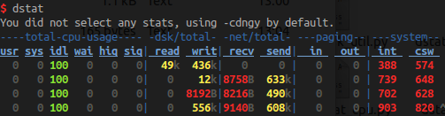
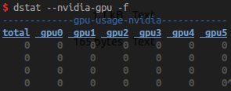
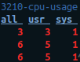

# dstat_plugins

A set of dstat plugins.

- [dstat_nvidia_gpu (by Vasilis Vryniotis)](#dstatnvidiagpu-by-vasilis-vryniotis)
- [dstat_nvidia_gpu_mem](#dstatnvidiagpumem)
- [dstat_pid_cpu](#dstatpidcpu)

## What is dstat?

[Dstat](https://github.com/dagwieers/dstat) is a versatile replacement for vmstat, iostat, mpstat, netstat and ifstat.



This repository aims to provide some plugins for dstat to monitor even more things than its built-ins.


## dstat_nvidia_gpu (by Vasilis Vryniotis)

dstat_nvidia_gpu is a dstat plugin monitoring GPU usage, created by [Vasilis Vryniotis](https://github.com/datumbox).

[github link](https://github.com/datumbox/dstat)

[blog](http://blog.datumbox.com/getting-the-gpu-usage-of-nvidia-cards-with-the-linux-dstat-tool/)



### installation
```
sudo apt-get install dstat #install dstat
sudo pip install nvidia-ml-py #install Python NVIDIA Management Library
wget https://raw.githubusercontent.com/datumbox/dstat/master/plugins/dstat_nvidia_gpu.py
sudo mv dstat_nvidia_gpu.py /usr/share/dstat/ #move file to the plugins directory of dstat
```

## dstat_nvidia_gpu_mem

`dstat_nvidia_gpu` monitors GPU usage only. `dstat_nvidia_gpu_mem` is a similar tool monitoring GPU **memory** usage.


### installation

```
sudo apt-get install dstat #install dstat
sudo pip install nvidia-ml-py #install Python NVIDIA Management Library
wget https://raw.githubusercontent.com/xplorld/dstat_plugins/master/dstat_nvidia_gpu_mem.py
sudo mv dstat_nvidia_gpu_mem.py /usr/share/dstat/ #move file to the plugins directory of dstat
```

### usage

```
dstat --nvidia-gpu-mem # see a single column of total GPU mem used
dstat --nvidia-gpu-mem -f # see per-device GPU mem used
```

## dstat_pid_cpu

`dstat_pid_cpu` monitors CPU usage of a specified process by its pid.




### installation

```
sudo apt-get install dstat #install dstat
wget https://raw.githubusercontent.com/xplorld/dstat_plugins/master/dstat_pid_cpu.py
sudo mv dstat_pid_cpu.py /usr/share/dstat/ #move file to the plugins directory of dstat
```

### usage

```
# use pid specified in environment DSTAT_CPU_PID or DSTAT_PID
DSTAT_PID=3210 dstat --pid-cpu
```


## contact me
rywang014 AT gmail DOT com
